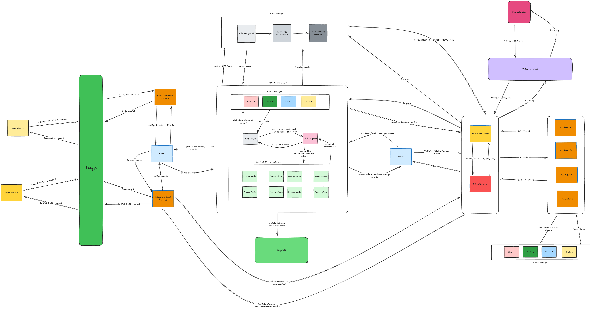

# SP1 bridge proof of concept

A Rust-led experiment in cross-chain transfers between local Ethereum and Base forks. Validators attest to a source bridge deposit root so users can claim against destination liquidity; an SP1 program checks receipt inclusion and compares deposit roots with recorded attestations.

This is an unaudited research prototype. The supplied runtime uses public Anvil development keys and **mock SP1 proving**. Its receipt roots are supplied by the host rather than authenticated by a consensus light client inside the guest. It must not custody real assets. See [security assumptions](SECURITY.md) before running it.



## What happens to a transfer

1. A user deposits ETH or a supported token on the source fork.
2. The Rust validator reads the indexed event and verifies its receipt proof.
3. Validators submit certificates and BLS attestations. A quorum of active validators pre-confirms the deposit root.
4. The user claims from liquidity already held by the destination bridge.
5. The Rust SP1 host constructs receipt witnesses; the guest checks them and emits settlement values for the validator manager.

Fast claims depend on the validator set. A proof checks the program's statement against its inputs; authenticating those inputs to the real chains is a separate trust requirement. [Architecture](ARCHITECTURE.md) explains component ownership and the remaining gaps.

## Run locally

Use Rust 1.92.0 (pinned in `rust-toolchain`), SP1 5.2.4 and Foundry 1.3.5 (`forge`, `cast`, `anvil`), Docker Compose, Bun 1.4.2 and Node.js 22 or later for tools that require Node. Bun 1.4.2 was the latest stable release verified for this change. The host-managed alternative also needs `screen`. The repository's SP1 installer verifies the official installer checksum and selects the matching guest compiler.

```bash
git clone --recurse-submodules https://github.com/sphamjoli/sp1-poc.git
cd sp1-poc
bash scripts/install-sp1.sh
export PATH="$HOME/.sp1/bin:$PATH"
bun install --frozen-lockfile
(cd contracts && bun install --frozen-lockfile)
(cd apps/web && bun install --frozen-lockfile)
corepack pnpm --dir indexer install --frozen-lockfile
cargo fetch --locked
make start-docker-stack STACK_NAME=docker
```

The stack forks public Ethereum and Base RPC endpoints configured in `config/chains/`. Local chain IDs `31338` and `31339` identify the forks, not the production networks. Validator stake and rewards live on fork `31339`.

The generated runtime file is `artifacts/runtime/docker/runtime.generated.json`. Ports can change when occupied; read that file for the actual addresses. Typical endpoints are:

| Service | Local URL |
|---|---|
| Web UI | http://127.0.0.1:4273 |
| Node manager | http://127.0.0.1:7011/healthz |
| Hasura GraphQL | http://127.0.0.1:8084/v1/graphql |
| Ethereum fork RPC | http://127.0.0.1:8545 |
| Base fork RPC | http://127.0.0.1:8546 |

Open the UI, connect a development wallet to the local forks, and use the supplied development assets. Never import a funded wallet into this runtime. To stop the stack:

```bash
make stop-docker-stack STACK_NAME=docker
```

That target removes Docker volumes and generated chain state. The optional host stack starts with `make start-local-stack STACK_NAME=local`; inspect its generated runtime file for endpoints.

## Develop and verify

[Contributing](CONTRIBUTING.md) describes the shared local checks, hooks, PR template and CI. Use locked installs and keep generated outputs out of source directories.

| Path | Responsibility |
|---|---|
| `crates/bridge-program` | SP1 guest: receipt, trie and event checks |
| `crates/bridge-script` | Proof host and local bridge scenarios |
| `crates/bridge-validator-evm` | Validator polling and attestations |
| `crates/validator-utils` | Shared runtime, signing and reconciliation |
| `crates/chain-manager` | RPC header and receipt-proof service |
| `crates/node-manager` | Local validator certificates and owner operations |
| `contracts` | Solidity bridge, validator and stake state |
| `apps/web` | Vue transfer and operations UI |
| `indexer` | Envio event indexing |
| `scripts` | Runtime generation and validation tooling |

Rust owns the proof and runtime services. Solidity owns on-chain state; TypeScript and Vue provide the UI and orchestration. Language statistics should count maintained source, with generated output and third-party dependencies excluded according to [GitHub Linguist](https://github.com/github-linguist/linguist/blob/main/docs/overrides.md).
